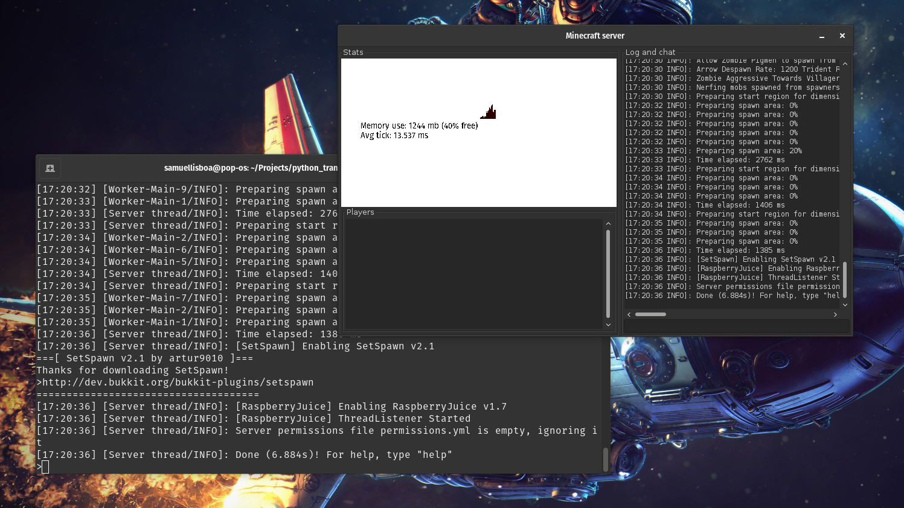
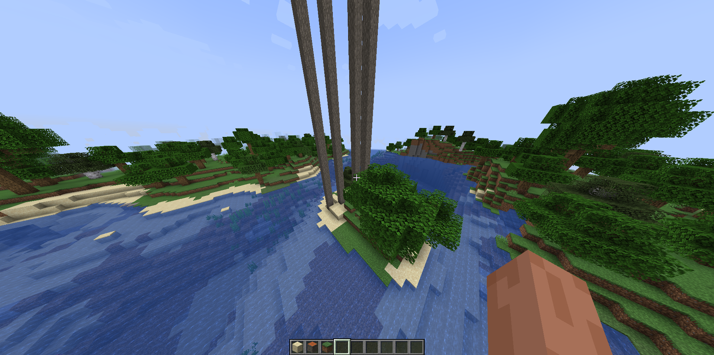
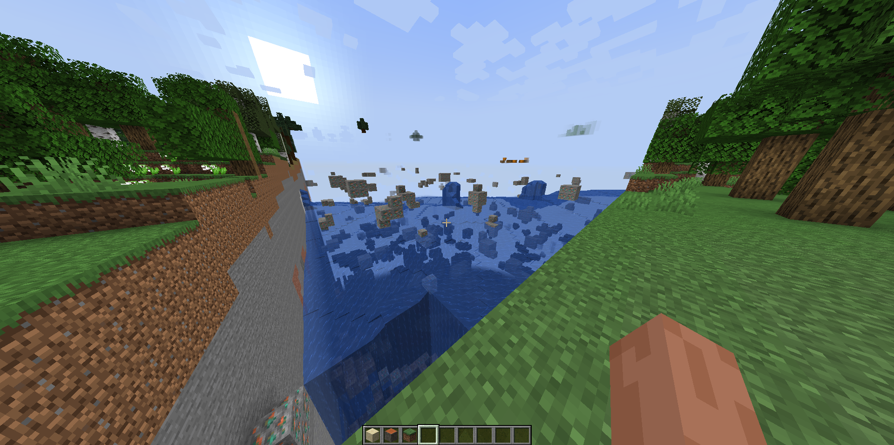

# python_transforming_minecraft
21/01/2023
Within the python operations we are going to modify a minecraft server with a little help from the pythonToMine api


### following the tutorial to start process
https://medium.com/@rodrigoka4/programando-em-python-e-transformando-o-mundo-de-minecraft-a-sua-maneira-3d94a275faec


## How it works

Issues for Minecraft API
### Windows

```
pip3 install mcpi
```

### Linux / MacOS

```bash
sudo pip3 install mcpi
```


We use spingot with some plugins to carry out the communication. 
We already have everything previously configured, just missing 
to run the server in mine_server_1.19.3/spigot-1.19.3.jar

``java -jar spigot-1.19.3.jar``

Com o servidor rodando pode executar seus comandos

``python index.py ``


## Using
https://github.com/martinohanlon/mcpi

## Minecraft Api Reference
https://www.stuffaboutcode.com/p/minecraft-api-reference.html


```python
#sets a block at an x, y, z co-ordinate to a particular type
mc.setBlock(0,0,0,block.DIRT.id)
#sets a block to a particular type and 'subtype'
mc.setblock(0,0,0,block.WOOD.id, 1)

#get the entity id of a name player 'nameuser'
entityId = mc.getPlayerEntityId("nameuser")
print(entityId)

#write 'Hello Minecraft World' to the chat window
mc.postToChat("Hello Minecraft World")

#set the players position as floats
mc.player.setPos(0.0,0.0,0.0)
```


### Minecraft.entity
The entity functions are used in conjunction with the .getPlayerEntityIds() 
function to interact with the entity (or players) in a game. 
Entity functions are useful for multiplayer games. 
[check more here](https://www.stuffaboutcode.com/p/minecraft-api-reference.html)

### IDS bloks
```
AIR                 = Block(0)
STONE               = Block(1)
GRASS               = Block(2)
DIRT                = Block(3)
COBBLESTONE         = Block(4)
WOOD_PLANKS         = Block(5)
SAPLING             = Block(6)
BEDROCK             = Block(7)
WATER_FLOWING       = Block(8)
WATER               = WATER_FLOWING
WATER_STATIONARY    = Block(9)
LAVA_FLOWING        = Block(10)
LAVA                = LAVA_FLOWING
LAVA_STATIONARY     = Block(11)
SAND                = Block(12)
GRAVEL              = Block(13)
GOLD_ORE            = Block(14)
IRON_ORE            = Block(15)
COAL_ORE            = Block(16)
WOOD                = Block(17)
LEAVES              = Block(18)
GLASS               = Block(20)
LAPIS_LAZULI_ORE    = Block(21)
LAPIS_LAZULI_BLOCK  = Block(22)
SANDSTONE           = Block(24)
BED                 = Block(26)
COBWEB              = Block(30)
GRASS_TALL          = Block(31)
WOOL                = Block(35)
FLOWER_YELLOW       = Block(37)
FLOWER_CYAN         = Block(38)
MUSHROOM_BROWN      = Block(39)
MUSHROOM_RED        = Block(40)
GOLD_BLOCK          = Block(41)
IRON_BLOCK          = Block(42)
STONE_SLAB_DOUBLE   = Block(43)
STONE_SLAB          = Block(44)
BRICK_BLOCK         = Block(45)
TNT                 = Block(46)
BOOKSHELF           = Block(47)
MOSS_STONE          = Block(48)
OBSIDIAN            = Block(49)
TORCH               = Block(50)
FIRE                = Block(51)
STAIRS_WOOD         = Block(53)
CHEST               = Block(54)
DIAMOND_ORE         = Block(56)
DIAMOND_BLOCK       = Block(57)
CRAFTING_TABLE      = Block(58)
FARMLAND            = Block(60)
FURNACE_INACTIVE    = Block(61)
FURNACE_ACTIVE      = Block(62)
DOOR_WOOD           = Block(64)
LADDER              = Block(65)
STAIRS_COBBLESTONE  = Block(67)
DOOR_IRON           = Block(71)
REDSTONE_ORE        = Block(73)
SNOW                = Block(78)
ICE                 = Block(79)
SNOW_BLOCK          = Block(80)
CACTUS              = Block(81)
CLAY                = Block(82)
SUGAR_CANE          = Block(83)
FENCE               = Block(85)
GLOWSTONE_BLOCK     = Block(89)
BEDROCK_INVISIBLE   = Block(95)
STONE_BRICK         = Block(98)
GLASS_PANE          = Block(102)
MELON               = Block(103)
FENCE_GATE          = Block(107)
GLOWING_OBSIDIAN    = Block(246)
NETHER_REACTOR_CORE = Block(247)
```


## Prints





